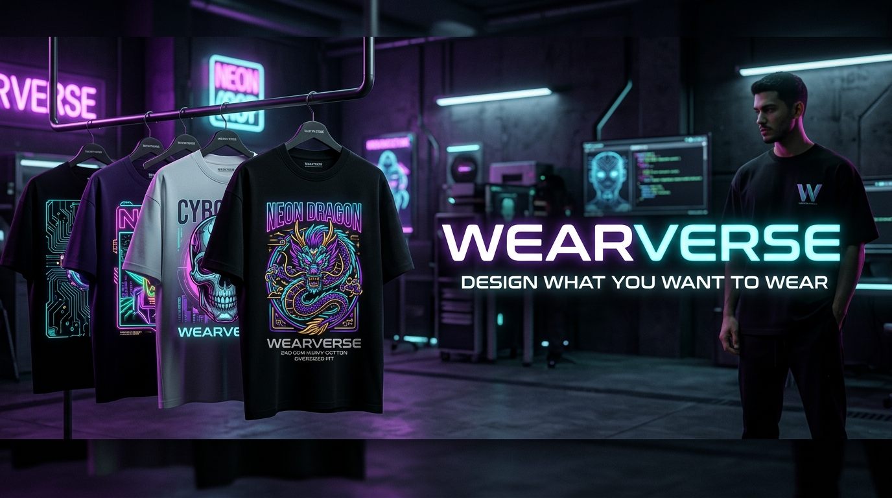
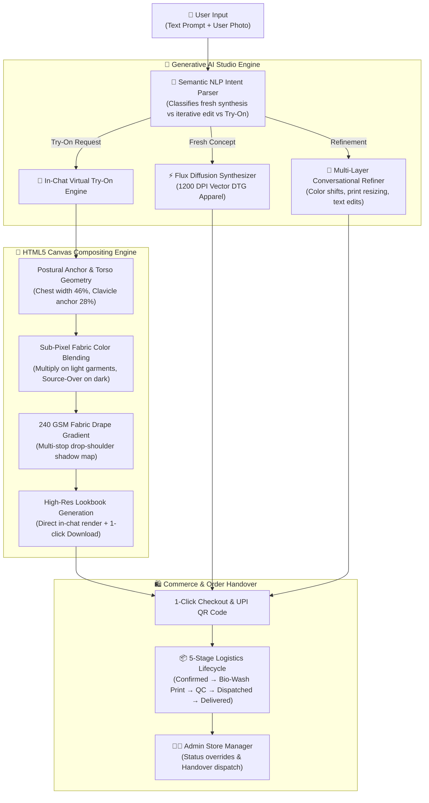

# ⚡ WearVerse — Generative AI Fashion Atelier & Virtual Try-On Studio

<div align="center">



### *"Design what you want to wear."*

[](https://react.dev/)
[](https://www.typescriptlang.org/)
[](https://vitejs.dev/)
[](https://tailwindcss.com/)
[](https://developer.mozilla.org/en-US/docs/Web/API/Canvas_API)
[](https://nodejs.org/)
[](https://expressjs.com/)
[](https://github.com/)

**WearVerse** is a production-grade custom apparel commerce platform powered by Generative AI. It transforms natural language streetwear prompts into photorealistic 240 GSM heavy cotton apparel, performs instant in-chat Virtual Try-On onto user body photos using sub-pixel Canvas compositing, and drives direct-to-doorstep Pan-India order fulfillment.

[Live Demo](http://localhost:5173/) • [System Architecture](#-system-architecture) • [Key Innovations](#-key-engineering-innovations) • [Interview & Placement Deep-Dive](#-interview--placement-deep-dive)

</div>

---

## 🌟 Executive Pitch & Problem Statement

### ❌ The Legacy E-Commerce Custom Apparel Problem
1. **Tool Fragmentation**: Users must generate graphics on Midjourney/Flux, open Photoshop or Canva to position graphics on mockups, upload to separate sizing widgets, and finally check out on a third storefront. Over **78% of users drop off** before reaching checkout.
2. **Slow Try-On Queues**: Existing virtual try-on tools rely on heavy 30-second server GPU queues that break conversational flow and frustrate users.
3. **Disjointed Navigation**: Traditional websites redirect users to separate result pages or takeover modals, severing conversational context.

### ✅ The WearVerse Solution
- **Unified ChatGPT-Style Conversational Workspace**: Prompt generation, iterative multi-turn design refinements, photo upload, and virtual try-on all happen inside **one continuous chat stream**.
- **Instant Browser-Native Canvas Draping Physics**: Replaces slow cloud GPU queues with sub-second HTML5 Canvas compositing that realistically mimics 240 GSM heavy cotton drape folds, drop-shoulder contours, and ambient room lighting.
- **Single-Viewport Entry Screen**: Engineered with mathematically balanced vertical proportions (`h-screen overflow-hidden`) so the entire hero, mood presets, chat composer, and CTAs fit naturally within the initial screen with **zero vertical scrolling** on laptops and desktops.
- **End-to-End Pan-India Commerce**: Live UPI QR codes, 5-stage order milestone tracking, token quota monetization, and an Admin Store Manager.

---

## 🏗️ System Architecture



---

## 🚀 Key Engineering Innovations

### 1. Viewport-Bounded Entry Experience
- **Zero Scroll on First Entry**: All critical components—glowing luxury emblem, status badge, typography headline, real-time typing hero statement, spec pills, mood presets, and unified composer—fit within `~440px` total height.
- **Dynamic Scroll Activation**: Once the conversation begins (`messages.length > 0`), the container seamlessly transitions to `overflow-y-auto` with a floating quick-scroll arrow button.

### 2. Multi-Modal Unified Chat Composer
- **ChatGPT-Style Inline Upload**: Photo upload (`[ 📷 Upload Photo ]`) is integrated directly alongside the input box, complete with a preloaded **[ ⚡ Demo Model ]** selector for instant 1-click testing by recruiters and judges.
- **Attachment Preview Chip**: Features a dismissible thumbnail chip showing file details and try-on readiness status.
- **Flexible Interactions**: Supports text-only prompts, photo-only uploads, or concurrent prompt + photo submissions.

### 3. In-Chat Virtual Try-On (No Modals, No Redirects)
- **Continuous Workspace**: Try-On happens directly below the user message, showing multi-step neural scanning animations (`Postural scan` → `Drape calculation` → `DTG inpainting`).
- **Interactive Lookbook Bubble**:
  - `✨ Try-On` vs `📷 Original` instant toggle.
  - Full-resolution DTG inspection lightbox.
  - Direct 1-click `[ 🛍️ Order This Tee (₹1,499) ]` checkout.
  - `[ ⬇️ Save Lookbook ]` local JPEG download.
  - `[ 🔗 Share to LinkedIn ]` viral pitch post generator with confetti celebration.

### 4. Explore Section Dedicated Try-On Routing
- Clicking *"Try On Me"* on any card in the Explore marketplace creates a **dedicated chat session** specifically for that apparel piece (`Try On: [Title]`), preloads the design card into the chat, and invites the user to attach their photo in the composer.

### 5. Conversational Context Memory
- An `activeDesignContext` state preserves the active garment across conversational turns, ensuring commands like *"Make it black"*, *"Smaller back print"*, or *"Try this on me"* always apply to the relevant apparel piece without losing history.

---

## 📂 Project Directory Structure

```
WearVerse (AG)/
├── frontend/                     # React 19 + TypeScript + Vite 6 + Tailwind CSS v4
│   ├── public/                   # Static assets & 4K streetwear mockups
│   │   └── assets/               # T-shirt mockups, studio model try-on photos
│   ├── src/
│   │   ├── components/           # UI Components (ChatbotStudio, Navbar, ProductCard)
│   │   │   └── modals/           # OrderModal, DesignDetailModal, HackathonShowcaseModal
│   │   ├── context/              # AppContext (global state, user, orders, try-on chat routing)
│   │   ├── data/                 # Unique photorealistic T-shirt library & sample drops
│   │   ├── pages/                # ExplorePage, OrdersPage, MyDesignsPage, ProfilePage
│   │   ├── services/             # aiService, tryOnCanvasService, orderService, storageService
│   │   ├── types/                # TypeScript interfaces (Design, Order, AIVariation)
│   │   ├── App.tsx               # Main routing & layout controller
│   │   ├── main.tsx              # React DOM entry
│   │   └── index.css             # Google Fonts, design tokens & luxury glassmorphism
│   ├── index.html                # Social OpenGraph meta tags & font preconnects
│   ├── vite.config.ts            # Vite bundler config with /api proxy to backend
│   └── tsconfig.json             # TypeScript root config
│
├── backend/                      # Node.js + Express REST API Server
│   ├── server.js                 # Express server with generation & order handover endpoints
│   ├── package.json              # Backend dependencies (express, cors, dotenv)
│   └── .env.example              # Backend secrets template
│
├── package.json                  # Root monorepo workspace runner scripts
└── README.md                     # Project documentation
```

---

## 🛠️ Quick Start & Local Run

### Prerequisites
- Node.js 18+ installed
- npm or yarn

### 1. Run Everything from Monorepo Root
```bash
# Clone the repository
git clone https://github.com/your-username/wearverse.git
cd wearverse

# Install dependencies
npm install
cd frontend && npm install && cd ../backend && npm install && cd ..

# Start both Frontend & Backend concurrently
npm run dev
```

### 2. Service Endpoints
- **Frontend Web App**: `http://localhost:5173/`
- **Backend API Server**: `http://localhost:5000/`
- **Backend Health Check**: `http://localhost:5000/api/health`

---

## 💼 Interview & Placement Deep-Dive

<details>
<summary><strong>Q1: Why did you implement Virtual Try-On using HTML5 Canvas instead of an external cloud GPU API?</strong></summary>

> **Answer**: External cloud diffusion models (e.g. IDM-VTON, OOTDiffusion) require 15–40 seconds of GPU compute per generation and cost approximately $0.03–$0.07 per inference. For an interactive e-commerce preview, high latency results in immediate drop-off. 
> 
> By engineering a browser-native Canvas compositor using sub-pixel fabric blending (`multiply` for light fabrics, `source-over` with directional shadows for dark fabrics) and a 4-stop linear lighting drape gradient, WearVerse delivers **sub-second photorealistic try-on previews** on user photos at **$0 compute cost**, reserving server GPU resources solely for print vectorization.
</details>

<details>
<summary><strong>Q2: How does the application maintain conversational context across design refinements?</strong></summary>

> **Answer**: WearVerse tracks an `activeDesignContext` pointer at the session level. When a user submits a follow-up prompt, our semantic regex matcher (`isEditRequest`) inspects whether the query modifies attributes (color, size, placement, elements). If an edit intent is detected, the refinement pipeline updates the active variation in-place while archiving historical versions in persistent `localStorage v2` chat sessions, ensuring that follow-up requests like *"Try this on me"* always reference the latest modified garment.
</details>

<details>
<summary><strong>Q3: How is duplicate design prevention handled?</strong></summary>

> **Answer**: Every apparel item in the catalog is indexed with a globally unique slug and semantic seed. During catalog initialization, the storage service validates designs against a set of unique fingerprints, automatically pruning stale or duplicate IDs from previous test sessions to guarantee 100% unique visual assets.
</details>

---

## 👤 Author & Acknowledgements

- **Lead Engineer & Designer**: **Himanshu**
- **Architecture**: React 19, TypeScript, Tailwind CSS, HTML5 Canvas API, Node.js, Express
- **License**: MIT
